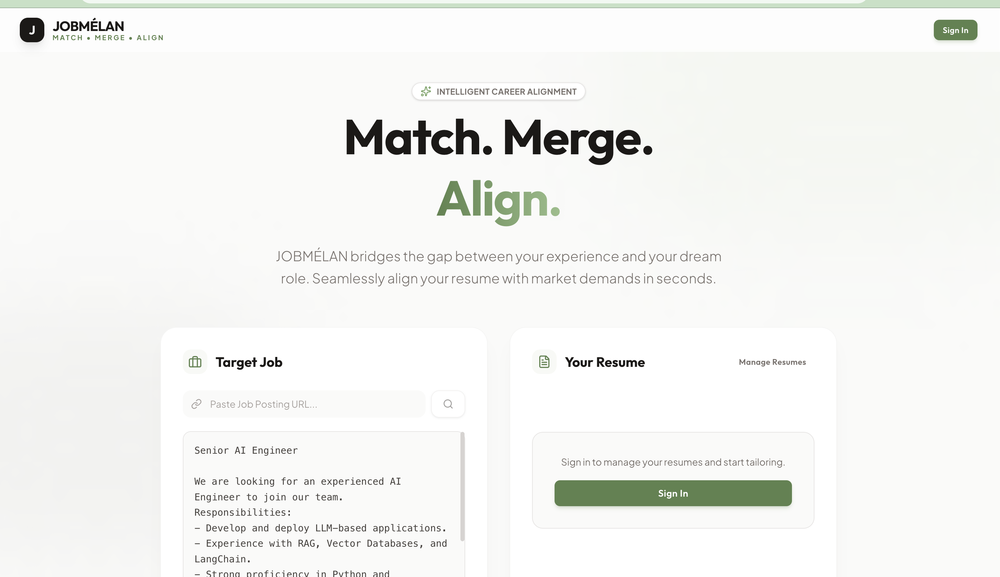

# JobMélan - AI-Powered Resume Optimization Platform

**Production Link:** [https://jobmelan-9ljoerr5i-naveenaddanki84s-projects.vercel.app/](https://jobmelan-9ljoerr5i-naveenaddanki84s-projects.vercel.app/)

JobMélan is an intelligent SaaS platform that helps job seekers optimize their resumes for ATS (Applicant Tracking Systems) and tailor them to specific job descriptions using AI. The platform bridges the gap between your experience and your dream role, seamlessly aligning your resume with market demands in seconds.

## 🎨 Homepage Preview



*The JobMélan homepage features a clean, modern design with a light green and white color palette. The intuitive two-column layout allows users to simultaneously view their target job and resume, making it easy to understand the alignment process at a glance.*

## 🎯 How It Works

### Core Workflow

1. **Resume Upload & Parsing**
   - Upload your resume in PDF, DOCX, TXT, or JSON format
   - AI (Google Gemini) automatically parses and extracts structured data:
     - Personal information (name, email, phone, location)
     - Work experience with bullet points
     - Education history
     - Skills organized by category
     - Projects and certifications
   - Data is stored in a structured JSON format for easy editing

2. **Job Description Analysis**
   - Paste a job description or provide a job posting URL
   - The AI extracts critical keywords, skills, and requirements from the job description
   - Identifies the top 25 most important hard skills, tools, and technologies needed

3. **ATS Optimization & Matching**
   - The system compares your resume against the job description keywords
   - Calculates a match score (0-100) based on keyword coverage
   - Identifies:
     - **Matched keywords**: Skills you already have
     - **Missing keywords**: Skills you should add or emphasize
   - Provides reasoning for the match score

4. **Resume Tailoring**
   - **Auto-Tailor Mode**: One-click optimization that:
     - Optimizes your skills section by adding missing keywords naturally
     - Generates a professional summary tailored to the job
     - Rewrites experience bullet points to include relevant keywords
     - Maintains authenticity while improving ATS compatibility
   
   - **Manual Editing**: Fine-tune individual sections with AI assistance:
     - Rewrite individual bullet points
     - Optimize entire sections
     - Suggest new bullet points
     - Improve skills organization

5. **Additional Features**
   - **Cover Letter Generation**: Creates personalized cover letters based on your resume and the job description
   - **Interview Preparation**: Generates relevant interview questions with tips
   - **Job Tracking**: Save and track your job applications with tailored resumes
   - **Profile Management**: Maintain a master profile that syncs across all documents
   - **Chrome Extension**: One-click resume tailoring directly from job posting pages

### Technical Architecture

**AI Processing Pipeline:**
- Uses Google Gemini 2.5 Flash model for all AI operations
- Structured JSON schema validation for consistent data extraction
- Server-side processing ensures API keys remain secure
- Real-time progress updates during AI operations

**Data Flow:**
1. User uploads resume → AI parsing → Structured JSON stored in database
2. User provides job description → Keyword extraction → Analysis
3. User triggers tailoring → AI optimization → Updated resume saved
4. User exports → PDF generation → Download

**Subscription Model:**
- **Free Tier**: Basic resume parsing, keyword analysis, limited document storage (2 documents)
- **Pro Tier**: Full access to all AI features, unlimited documents (5 documents), cover letter generation, interview prep, section rewriting

## ✨ Key Features

### 🤖 AI-Powered Resume Parsing
- Automatically extracts structured data from any resume format
- Handles PDF, DOCX, TXT, and JSON files
- Intelligent field mapping and organization

### 🎯 ATS Optimization
- Keyword matching against job descriptions
- Match score calculation (0-100)
- Identifies missing and matched keywords
- Provides actionable recommendations

### ✂️ Smart Resume Tailoring
- One-click auto-tailoring for quick optimization
- Granular control for manual editing
- Maintains resume authenticity while improving ATS compatibility
- Real-time preview of changes

### 📝 Cover Letter Generation
- Generates personalized cover letters
- Customizable tone and style
- Incorporates relevant experience and skills
- Professional formatting

### 🎤 Interview Preparation
- Generates role-specific interview questions
- Provides tips and key points to mention
- Mix of technical and behavioral questions

### 📊 Job Application Tracker
- Save job postings with descriptions
- Link tailored resumes to applications
- Track application status
- Organize your job search

### 🔌 Chrome Extension
- One-click resume tailoring from job sites
- Automatic job description extraction
- Seamless integration with web platform
- Works on LinkedIn, Indeed, Greenhouse, and more

### 👤 Profile Management
- Central profile that syncs across documents
- Profile completion tracking
- Equal employment opportunity form support
- Document organization

## 🛠️ Tech Stack

- **Frontend**: Next.js 16 (App Router), React 19, TypeScript
- **Styling**: Tailwind CSS 4
- **Authentication**: Clerk
- **Database**: PostgreSQL with Prisma ORM
- **AI/ML**: Google Gemini 2.5 Flash API
- **Payments**: Stripe (via Clerk)
- **File Processing**: PDF.js, Mammoth.js
- **Deployment**: Vercel
- **Chrome Extension**: Vanilla JavaScript with Content Scripts

## 🚀 Getting Started

### Prerequisites
- Node.js 18+ and npm/yarn/pnpm
- PostgreSQL database
- Google Gemini API key
- Clerk account for authentication
- Stripe account (for payments, optional)

### Installation

1. **Clone the repository**
   ```bash
   git clone <repository-url>
   cd jobmelan-saas
   ```

2. **Install dependencies**
   ```bash
   npm install
   # or
   yarn install
   # or
   pnpm install
   ```

3. **Set up environment variables**
   Create a `.env` file in the root directory:
   ```env
   # Clerk Authentication
   NEXT_PUBLIC_CLERK_PUBLISHABLE_KEY=your_clerk_publishable_key
   CLERK_SECRET_KEY=your_clerk_secret_key
   CLERK_WEBHOOK_SECRET=your_webhook_secret
   CLERK_PRO_PLAN_ID=your_pro_plan_id

   # Database
   DATABASE_URL=your_postgresql_connection_string

   # AI
   GEMINI_API_KEY=your_gemini_api_key

   # App URL
   NEXT_PUBLIC_APP_URL=http://localhost:3000
   ```

4. **Set up the database**
   ```bash
   npx prisma generate
   npx prisma migrate dev
   ```

5. **Run the development server**
   ```bash
   npm run dev
   # or
   yarn dev
   # or
   pnpm dev
   ```

6. **Open your browser**
   Navigate to [http://localhost:3000](http://localhost:3000)

## 📁 Project Structure

```
jobmelan-saas/
├── src/
│   ├── actions/          # Server actions for data operations
│   │   ├── ai-actions.ts  # AI-powered features (parsing, tailoring, etc.)
│   │   ├── profile-actions.ts
│   │   ├── resume-actions.ts
│   │   └── ...
│   ├── app/              # Next.js app router pages
│   │   ├── api/          # API routes
│   │   ├── dashboard/    # Job tracker dashboard
│   │   ├── editor/       # Resume editor
│   │   ├── profile/      # Profile management
│   │   └── ...
│   ├── components/       # React components
│   ├── lib/              # Utility functions and configurations
│   └── types/            # TypeScript type definitions
├── chrome-extension/     # Chrome extension for one-click tailoring
├── prisma/               # Database schema and migrations
└── public/               # Static assets
```

## 🔐 Authentication & Authorization

- User authentication handled by Clerk
- Webhook integration syncs user data and subscription status
- Pro features protected by subscription checks
- Server-side validation ensures data security

## 📚 Learn More

- [Next.js Documentation](https://nextjs.org/docs)
- [Clerk Documentation](https://clerk.com/docs)
- [Prisma Documentation](https://www.prisma.io/docs)
- [Google Gemini API](https://ai.google.dev/docs)

## 📖 Project History

For a detailed history of the project, including phase completion reports, fix guides, and deployment checklists, please refer to [PROJECT_HISTORY.md](PROJECT_HISTORY.md).

## 🚢 Deployment

The application is deployed on Vercel. The easiest way to deploy your Next.js app is to use the [Vercel Platform](https://vercel.com/new?utm_medium=default-template&filter=next.js&utm_source=create-next-app&utm_campaign=create-next-app-readme) from the creators of Next.js.

Check out our [Next.js deployment documentation](https://nextjs.org/docs/app/building-your-application/deploying) for more details.

---

**Live Application**: [https://jobmelan-9ljoerr5i-naveenaddanki84s-projects.vercel.app/](https://jobmelan-9ljoerr5i-naveenaddanki84s-projects.vercel.app/)
